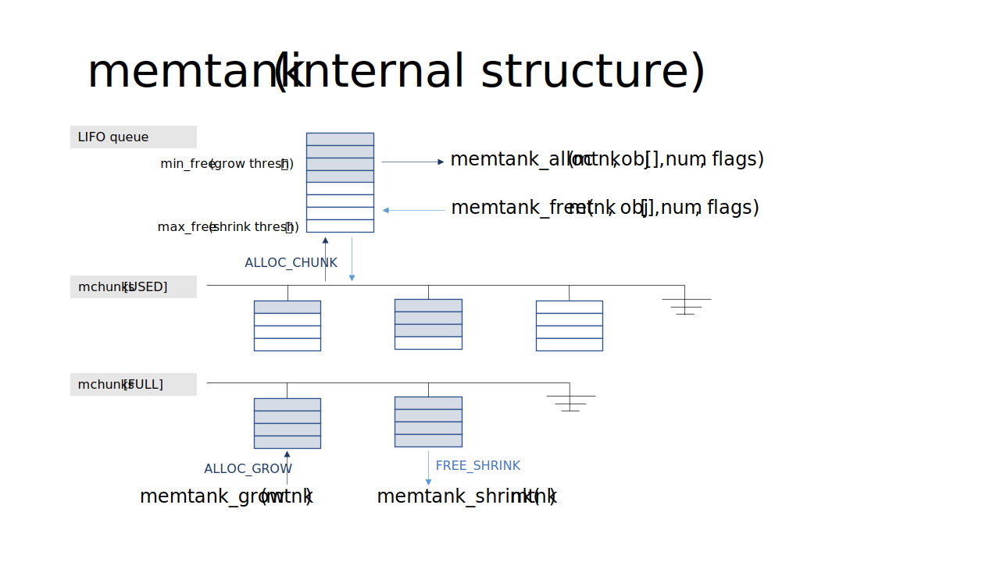

..  SPDX-License-Identifier: BSD-3-Clause
    Copyright(c) 2026 Huawei Technologies Co., Ltd

Memtank Library
===============

The memtank library is a fixed sized object allocator for DPDK applications.
Same a s mempool it allows to alloc/free bulk of objects of fixed size in a
lightweight manner.
But in addition it can grow/shrink dynamically plus provides extra
additional API for higher flexibility:

* manual grow()/shrink() functions

* different alloc/free policies
  (can be specified by user via flags parameter):

  * lightweight as possible, but can fail

  * more robust, but heavyweight - might cause call to user-provided backing
    memory allocator.

* user provided callbacks for actual system-wide memory reservations.
  User is free to choose whatever is most suitable way for his/her scenario,
  i.e: via malloc/rte_malloc/mmap/some custom allocator.

* user defined constructor callback for newly allocated objects.

* built-in per object runtime verify (boundary violation, double free, etc.) –
  controlled by flags at memtank creation time.


Memtank usage scenarios
-----------------------

Use memtank when:

* Relatively small objects of the same size are allocated and freed on the
  data path with low, predictable latency requirements.

* Pre-allocation memory for maximum possible number of objects is not
  feasible.


Internals
---------

Internally each memtank consists of:

* Fixed size LIFO queue that serves as a pool of free objects for fast
  allocation/deallocation. It's internals and behavior are very similar
  to current mempool LIFO driver.

* Two lists (USED, FREE) of memchunks. Memchunk is an analog of SLAB:
  For performance reasons memtank tries to allocate memory in relatively
  big chunks (memchunks) and then split each memchunk in dozens (or hundreds)
  of objects. Objects from memchunks are used to populate pool of free
  objects (see above).

* Each memchunk consists of some metadata plus array of free objects (LIFO)
  that belong to that chunk. As soon as number of free objects in the chunk
  becomes equal to the total number of objects it considered as ```FREE```
  and can be 'shrinked' - relased back to the memory subsystem.

* Each object within memtank is a properly aligned and initialized data buffer
  that will be provided to the user followed by the metadata that is used
  to determine which memchunk it belongs to plus some extra fields used for
  statisitics collection and runtime verification. Total size of the metadata
  for each object: 32B.

There are two user defined thresholds that control memtank grow/shrink
behavior:

* ```min_free``` - grow threshold. That value controls two things: when it is
  time to request for more memory from the underlying memory subsystem and how
  many memory has to be requested/released in one go.

* ```max_free``` - shrink threshold. That value determines when it is ok for
  memtank to start to release unused memory back to the underlying memory
  subsystem.

Also user can define a grow limit: ```max_obj``` - maximimum possible number
of objects that given memtank can contain. By setting all these three
parameters to the same value, memtank behaves like mempool with LIFO driver.

.. _figure_memtank-internals:




Brief API description
---------------------

* ```rte_memtank_create()```/```rte_memtank_destroy()``` are responsible for
creation/destroying the memntank.

* ```rte_memtank_alloc()```/```rte_memtank_free()``` - perform objects
  allocation/deallocation from/to the memntank. Note that both of them
  operate in bulks and accept extra flag parameter to allow user to specify
  exact behavior.

* ```rte_memtank_chunk_alloc()```/```rte_memtank_chunk_free()``` also perform
  allocation/deallocation from/to the memntank. Though these functions bypass
  pooll of free objects and allocate/free objects straight from/to the pool.

* ```rte_memtank_grow()```/```rte_memtank_shrink()``` are intended to
  explicitly reserve/release memory from/to underlying memory subsystem and
  add/remove objects to/from the tank. Possible usage scenario - either some
  house-keeping task, or even data-path thread  during idle periods.

* ```rte_memtank_dump()```/```rte_memtank_sanity_check()``` - miscelanneous
  API for statistics/internal dumping and sanity cheking.


Aled public API functions except ```rte_memetank_destroy()``` are MT safe and
can be called concurrently from different threads.

Object allocation
~~~~~~~~~~~~~~~~~

By default ```rte_memtank_alloc()``` first tries to get objects from the free
objects pool. If there are not enough free objects in the pool, then behavior
depends on the flag values user provided:

* none - alloc() will simply return to the user obtained from the pool objects.

* ```RTE_MTANK_ALLOC_CHUNK``` - alloc() will try to get remaining free objects
  from already allocated memchunks.

* If already allocated memchunks also don't contain enough
  free objects and ```RTE_MTANK_ALLOC_GROW``` is specified, then it will try
  to perform ```grow``` operation by allocating extra memory from the
  underlying memory susbystem and creating new memchunks to satisfy user
  request.

In last two cases, it will try to refill free pool up to ```min_free```
threshold value.

Object de-allocation
~~~~~~~~~~~~~~~~~~~~

In reverse, ```ret_memtank_free()``` first tries to put objects back to
the free pool. In case there is not enough room, it puts remaining free
objects to the memchunks they belong to. After that, if
```RTE_MTANK_FREE_SHRINK```` is specified it starts ```shrink``` operation
to return unused memchunks back to the memory subsystem.


Grow/Shrink
~~~~~~~~~~~

Apart from invoking ```grow```/```shrink``` implicitly (via alloc/free flags)
there is an API for explicit invocation:

* ```rte_memtank_grow(struct rte_memtank \*)``` - if number of objects in
the free pool drops below ```min_free``` thershold, it requests next memory
region from the udnerlying memory subsystem, creates new memchunks from it
and populates the pool.

* ```rte_memtank_shrink(struct memtank \*)``` - if total number of free objects
in the tank exceeds ```max_free``` theshold it de-allocates unused memchunks
back to the underlying memory subsystem.


Create/Destroy
~~~~~~~~~~~~~~

.. code-block:: c

   sruct user_defined_type;

   /*
    * User defined callbacks to reserve/release memory from/to backing
    * memory subsystem.
    */

   static void *
   user_defined_alloc(size_t sz, void *udata)
   {
        RTE_SET_USED(udata);
        return rte_malloc(NULL, sz, 0);
   }

   static void
   user_defined_free(void *buf, void *udata)
   {
        RTE_SET_USED(udata);
        rte_free(buf);
   }

   /*
    * As used needs new memtank he fills memtank param structure and calls
    *  rte_memtank_create():
    */
    static struct rte_memtank_prm prm = {
        /* min number of free objs in the pool (grow threshold). */
        .min_free = 1024,
        /* max number of free objs (shrink threshold)a */
        .max_free = 1024 * 1024,
        .obj_size = sizeof(struct user_defined_type);
        .obj_align = alignof(struct user_defined_type);
        .nb_obj_chunk = 2 * 1024,
        /* enable obj runtime verify and stats collection */
        .flags = RTE_MTANK_OBJ_DBG,
        /* user defined callbacks to reserve/release actual memory */
        .alloc = user_defined_alloc,
        .free = user_define_free,
   };

   struct rte_memtank *mt = rte_memtank_create(&prm);

   ....

   /* no more objects from the memtank are in use */
   rte_memtank_destroy(mt);


Known limitations (subject for further improvements):
-----------------------------------------------------

* scalability:
  after 8+ lcores conventional mempool (with FIFO) starts to outperform
  memtank (which by default uses LIFO inside).

* mempool_cache integration is not part of the library and right now
  has to be implemented by used manually on top of memtank API.

* As pool of free objects might contain objects from different memchunks,
  it can prevent some memchunks to get deallocated and returned back to
  the memory subsystem.

